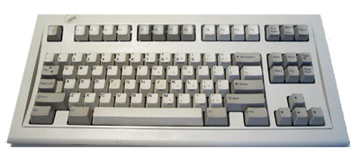

Nostalgia bucklespring keyboard sound
=====================================

Copyright 2016 Ico Doornekamp

This project emulates the sound of my old faithful IBM Model-M space saver
bucklespring keyboard while typing on my notebook, mainly for the purpose of
annoying the hell out of my coworkers.



Bucklespring runs as a background process and plays back the sound of each key
pressed and released on your keyboard, just as if you were using an IBM
Model-M. The sound of each key has carefully been sampled, and is played back
while simulating the proper distance and direction for a realistic 3D sound
palette of pure nostalgic bliss.

To temporarily silence bucklespring, for example to enter secrets, press
ScrollLock twice (but be aware that those ScrollLock events _are_ delivered to
the application); same to unmute. The keycode for muting can be changed with
the `-m` option. Use keycode 0 to disable the mute function.

Installation
------------

### Linux

To compile on debian-based linux distributions, first make sure the require
libraries and header files are installed, then simply run `make`:

```
$ sudo apt-get install libopenal-dev libalure-dev libxtst-dev
$ make
$ ./buckle
```

#### Ubuntu (since 16.04) and distros supporting [snapd](http://snapcraft.io/)
```
$ sudo snap install bucklespring
$ bucklespring.buckle
```
To run it on startup, use this upstart script (paste this command in a terminal to generate it):
```
$ cat > ~/.config/upstart/bucklespring.conf << EOF
description "Nostalgia bucklespring keyboard sound"

start on desktop-start
stop on desktop-end
respawn
exec bucklespring.buckle #-g 30
EOF
```

### MacOS

I've heard rumours that bucklespring also runs on MacOS. I've been told that
the following should do:

```
$ brew install alure pkg-config
$ make
$ sudo ./buckle
```

Note that you need superuser privileges to create the event tap on Mac OS X.


### Windows

I think the windows build is currently broken, it seems that switching from
Freelut to Alure broke windows, I might fix this one day. 

I suspect there is something wrong with `alureCreateBufferFromFile()` getting
called from another thread in the key capture callback, but my knowledge of the
win32 platform is so poor I'm not even able to run a debugger to see what is
happening. Help from an expert is much appreciated.


Usage
-----

````
usage: ./buckle [options]

options:

  -d DEVICE use OpenAL audio device DEVICE
  -g GAIN   set playback gain [0..100]
  -h        show help
  -l        list available openAL audio devices
  -m CODE   use CODE as mute key (default 0x46 for scroll lock)
  -p PATH   load .wav files from directory PATH
  -s WIDTH  set stereo width [0..100]
  -v        increase verbosity / debugging
````

OpenAL notes
------------


Bucklespring uses the OpenAL library for mixing samples and providing a
realistic 3D audio playback. This section contains some tips and tricks for
properly tuning OpenAL for bucklespring.

* The default OpenAL settings can cause a slight delay in playback. Edit or create 
  the OpenAL configuration file `~/.alsoftrc` and add the following options:

 ````
 period_size = 32
 periods = 4
 ````

* If you are using headphones, enabling the head-related-transfer functions in OpenAL 
  for a better 3D sound:

 ````
 hrtf = true
 ````
 
* When starting an OpenAL application, the internal sound card is selected for output, 
  and you might not be able to change the device using pavucontrol. The option to select 
  an alternate device is present, but choosing the device has no effect. To solve this, 
  add the following option to the OpenAL configuration file:
 
 ````
 allow-moves = true
 ````
